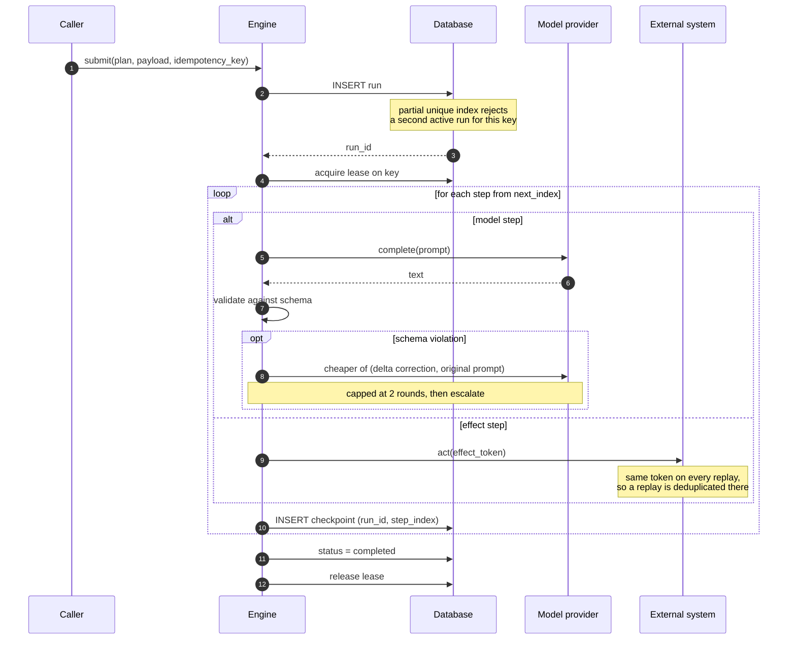

# Architecture

## The problem this is shaped around

An agent run is a sequence of steps, some of which are expensive and some of
which are irreversible. The expensive ones cost tokens. The irreversible ones
move money, send messages, or write to systems this process does not own.

A run that restarts from the beginning after a crash gets both wrong: it pays
for the expensive steps again, and it may perform an irreversible step a second
time. Keeping run state in process memory guarantees exactly that outcome the
first time a worker is restarted.

So the state lives in a database and the engine holds nothing.

## The flow

## Why resume position is derived, not stored

A `current_step` column would be a second source of truth, and it would be wrong
in exactly the situation that matters: a process that dies after writing the
checkpoint but before updating the column, or the reverse.

Checkpoints are append-only rows keyed on `(run_id, step_index)`. Resume position
is the first index with no row. There is nothing to keep in sync because there is
only one record of what happened.

The cost is a read of all checkpoints at resume. For plans of the size this
targets — tens of steps, not thousands — that is one indexed query.

## The window a transaction cannot close

Between performing an external effect and committing its checkpoint, the process
can die. The effect happened; the record of it did not. No transaction in *this*
database can span that gap, because the effect lives in a system that is not part
of it.

Two-phase commit would close it and is not available: payment gateways do not
enlist in your transaction manager.

What is available is making the replay harmless. The effect token is derived
from `(run_id, step_index)`, so a replayed step presents the same token it
presented before. A gateway that deduplicates on an idempotency key — which is
standard, and which MercadoPago, Stripe and others all implement — recognises it
and returns the original result instead of acting again.

This moves the guarantee to where it can be enforced. It also means the guarantee
is conditional, and the README says so: it holds for external systems that
honour the token, and not for ones that do not.

## Locking

The first implementation held a write transaction open for the duration of a run.
SQLite allows one writer, and the lock was it, so the engine deadlocked against
its own checkpoint writes. Every resume test failed on a ten-second timeout.

The replacement is a lease: a row with an owner and an expiry, written and
committed immediately. It excludes other workers without excluding the work.

The expiry is what makes a crashed holder recoverable — otherwise a worker that
died holding the lock would block that key until an operator cleared it by hand.
Release is scoped to the owner, so a worker whose lease already lapsed cannot
delete the lock its successor is now holding.

## PostgresStore, designed and not yet built

The SQLite backend is what lets the demo run with no setup, and its lock is a
single-machine approximation. The Postgres shape:

- `pg_try_advisory_xact_lock(lock_id)` for the run lock, released automatically
  when the transaction ends — no lease expiry to tune, no orphaned locks.
- The same partial unique index, which Postgres supports natively.
- `JSONB` for payloads and step output, so checkpoints are queryable rather than
  opaque blobs.
- `asyncpg` with a bounded pool, sized against measured contention rather than
  guessed.

The lock id is already computed with `blake2b` rather than Python's `hash()`,
because `hash()` for strings is randomised per process: two workers would derive
different lock ids for the same key and the lock would protect nothing.
`tests/test_lock_identity.py` demonstrates that failure in subprocesses rather
than asserting the fix.

## What was deliberately left out

**Semantic caching.** An embedding-similarity cache in front of the provider was
considered and dropped. It adds a model dependency and a similarity threshold to
tune, in exchange for savings that only appear at a request volume this does not
have. Exact caching would be the first thing to add; semantic caching is where
complexity outruns value.

**Compensation.** A run that escalates after a committed effect leaves it in
place. Compensating steps are the natural next layer, and adding them without a
concrete failure to design against would produce a mechanism shaped by
imagination rather than by a real case.

**A real provider adapter.** The provider protocol is one method. Wiring an
actual API is a small amount of code and would make the test suite depend on a
key, a network and a bill — which would make the claims here unverifiable by the
person reading them.
