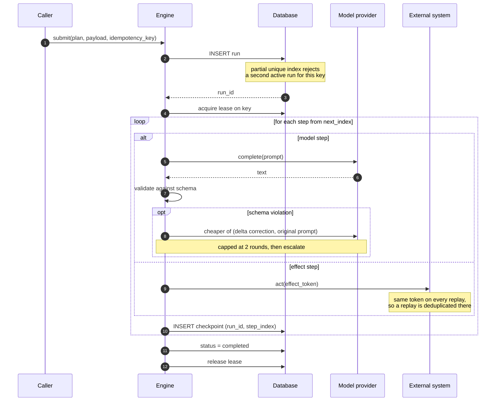

# Architecture

## The problem this is shaped around

An agent run is a sequence of steps, some of which are expensive and some of
which are irreversible. The expensive ones cost tokens. The irreversible ones
move money, send messages, or write to systems this process does not own.

A run that restarts from the beginning after a crash gets both wrong: it pays
for the expensive steps again, and it may perform an irreversible step a second
time. Keeping run state in process memory guarantees exactly that outcome the
first time a worker is restarted.

So the state lives in a database and the engine holds nothing.

## The flow

## Why resume position is derived, not stored

A `current_step` column would be a second source of truth, and it would be wrong
in exactly the situation that matters: a process that dies after writing the
checkpoint but before updating the column, or the reverse.

Checkpoints are append-only rows keyed on `(run_id, step_index)`. Resume position
is the first index with no row. There is nothing to keep in sync because there is
only one record of what happened.

The cost is a read of all checkpoints at resume. For plans of the size this
targets — tens of steps, not thousands — that is one indexed query.

## Resume position is an index, so the plan behind it is checked

Deriving resume position from checkpoints removes one source of truth. It
introduces a subtler one: the index means nothing without the plan it indexes
into, and `run()` takes that plan from the caller.

A rolling deploy separates the two. Worker v1 dies after step 1; worker v2 is
already on new code and picks the run up. If a step was removed in between,
index 2 no longer refers to the same work — and the engine would execute the
wrong step, mark the run complete, and never charge the customer. Silently: no
error, no escalation, a `completed` row.

So before resuming, the recorded step names are compared against the plan given.
A mismatch raises `PlanChanged` and the run is left alone, still resumable under
the plan it began with.

Only the prefix that already executed is checked. Steps beyond the resume point
have not happened, so a plan that grows a tail between deploys is still valid
for an in-flight run — otherwise every deploy would break every run in flight,
which would make the guard worse than the problem.

## The window a transaction cannot close

Between performing an external effect and committing its checkpoint, the process
can die. The effect happened; the record of it did not. No transaction in *this*
database can span that gap, because the effect lives in a system that is not part
of it.

Two-phase commit would close it and is not available: payment gateways do not
enlist in your transaction manager.

What is available is making the replay harmless. The effect token is derived
from `(run_id, step_index)`, so a replayed step presents the same token it
presented before. A gateway that deduplicates on an idempotency key — which is
standard, and which MercadoPago, Stripe and others all implement — recognises it
and returns the original result instead of acting again.

This moves the guarantee to where it can be enforced. It also means the guarantee
is conditional: it holds for external systems that honour the token, and not for
ones that do not. The README states the same condition rather than leaving it to
this file.

## Locking on SQLite

SQLite allows exactly one writer. A lock implemented as a held write transaction
would therefore be that writer, and would exclude the engine's own checkpoint
writes for the duration of the run — the lock and the work competing for the
same resource.

The lock is a lease instead: a row with an owner and an expiry, written and
committed immediately. It excludes other workers without excluding the work.

The expiry is what makes a crashed holder recoverable. Without it, a worker that
died holding the lock would block that key until an operator cleared it by hand.
Release is scoped to the owner, so a worker whose lease has already lapsed
cannot delete the lock its successor now holds.

## The PostgreSQL backend

The SQLite backend is what lets the demo run with no setup, and its lock is a
single-machine approximation. `PostgresStore` is the real one:

- `pg_try_advisory_lock(lock_id)` for the run lock — session-scoped, released by
  the database when the connection goes away. No lease to expire, nothing to
  reclaim after a crashed worker.
- The same partial unique index, which Postgres supports natively.
- `JSONB` for payloads and step output, so checkpoints are queryable rather than
  opaque blobs.
- `psycopg` 3 synchronously, not `asyncpg`. asyncpg is async-only, and adopting
  it would mean converting a sequential engine to async for no benefit at this
  scale. The engine did not change to accommodate the backend.
- No connection pool yet. Connections are opened per operation, which is honest
  at this size. A pool belongs here once there is a measured contention number
  to size it against.

### Why the lock is session-scoped

`pg_try_advisory_xact_lock` looks tidier: the transaction owns the lock, so
there is no explicit release to forget. It is the wrong trade here.

A transaction-scoped lock must keep a transaction open for as long as the lock
is held. For an agent run measured in minutes, that leaves the connection `idle
in transaction`, which pins a snapshot so VACUUM cannot clean up behind it, pins
a server connection under PgBouncer in transaction mode, and is killed outright
by any deployment that sets `idle_in_transaction_session_timeout`.

That is observable in `pg_stat_activity`, and the observation is a test:
`tests/test_postgres_lock.py::test_holding_the_lock_does_not_hold_a_transaction`
fails if the lock is ever changed to the transaction-scoped form. A design
decision that lives only in a comment is a decision waiting to be tidied away.

### Test isolation

Each Postgres test runs in its own schema, created at setup and dropped at
teardown.

Truncating shared tables is the cheaper-looking option and it is fragile
isolation: one lost commit or one leaked connection lets a test inherit
another's rows, and the symptom surfaces as a foreign-key violation far from its
cause. A private schema cannot be contaminated.

The lock id is already computed with `blake2b` rather than Python's `hash()`,
because `hash()` for strings is randomised per process: two workers would derive
different lock ids for the same key and the lock would protect nothing.
`tests/test_lock_identity.py` demonstrates that failure in subprocesses rather
than asserting the fix.

## Escalation and failure are different outcomes

`Escalation` means the engine gave up in a way a human should review: a provider
that stayed unavailable, a schema the model could not satisfy in two
corrections. It is a business outcome, and the run is marked `escalated`.

Anything else a handler raises is a defect — a typo, a bad cast, a library
throwing something undocumented. That is marked `failed` and re-raised, so the
traceback reaches whoever has to fix it rather than being absorbed into a status
column.

Recording a terminal state before re-raising is not tidiness. The partial unique
index in I-1 permits exactly one non-terminal run per idempotency key, so a run
left in `running` would refuse every future submission for that key. A single
unhandled exception would make that customer's order permanently unprocessable,
recoverable only by editing the database by hand — a much worse failure than the
defect that caused it.

The one exception is `SimulatedCrash`, which models the process dying. A dead
process writes nothing, so neither does the engine: the run stays resumable,
which is what the resume tests are there to measure.

## A store outage is not a broken run

Two failures reach `run()` looking alike and meaning opposite things.

A handler raising is a defect in this run's code. Retrying it unchanged fails
again, so the run is marked `failed`.

The store raising is infrastructure. Nothing is wrong with the run; the database
is unreachable. It has to stay non-terminal so it resumes and finishes when the
database returns. Marking it failed would turn a transient outage into permanent
loss for every run in flight at that moment — much larger than the outage.

The engine separates them by where its `try` ends: the handler call is inside
it, the checkpoint write is not. That is a fragile place for a decision this
consequential to live, so `tests/test_store_outage.py` pins it. The fake outage
there refuses only successful checkpoints and lets failure records through —
otherwise, with the whole store down, the error path could not write either and
the test could not tell an intended non-terminal run from an accidental one.

The effect still runs twice across the outage: once before the write failed,
once on resume. Both present the same token, so the gateway charges once. This
is the same property that makes the lock optional, arriving from a different
direction.

## The lock is an optimisation, not the guarantee

Locks fail in both backends, in opposite ways.

A SQLite lease can expire while its holder is still alive and working — the
classic hazard of lease-based locking, and the reason distributed systems reach
for fencing tokens. A Postgres session lock has the inverse problem: it is held
by the connection, so a handler that hangs on a network call keeps it until
someone kills the process. Neither backend can promise that exactly one worker
is executing a given run at a given instant.

That would be alarming if the guarantee rested on mutual exclusion. It does not.

The effect token is derived from `(run_id, step_index)`, so two workers running
the same step present the *same* token, and the external system deduplicates
them. The checkpoint's primary key does the same job for state: whoever writes
second is a no-op. `tests/test_lock_is_an_optimisation.py` removes the lock
entirely, drives three workers into the same effect through a barrier, and
asserts the gateway still sees one token.

So the lock earns its place for a different reason: it keeps the engine from
paying for the same work twice. Losing it costs money in tokens, not
correctness. That distinction is worth being explicit about, because a design
whose safety depends on a lock is a design that fails the first time the lock
does.

## What was deliberately left out

**Semantic caching.** An embedding-similarity cache in front of the provider was
considered and dropped. It adds a model dependency and a similarity threshold to
tune, in exchange for savings that only appear at a request volume this does not
have. Exact caching would be the first thing to add; semantic caching is where
complexity outruns value.

**Compensation.** A run that escalates after a committed effect leaves it in
place. Compensating steps are the natural next layer, and adding them without a
concrete failure to design against would produce a mechanism shaped by
imagination rather than by a real case.

**A real provider adapter.** The provider protocol is one method. Wiring an
actual API is a small amount of code and would make the test suite depend on a
key, a network and a bill — which would make the claims here unverifiable by the
person reading them.

## Operational trade-offs

Deployment-shaped rather than engine-shaped: none of these change what the
engine guarantees, and all of them decide what it costs to run.

**Connections are opened per operation.** There is no pool. Postgres defaults to
100 `max_connections`, so several hundred concurrent workers would exhaust it
and start being refused. PgBouncer in front, or `psycopg_pool` sized against
measured contention, is the answer — and the sizing needs the measurement, which
is why there is no arbitrary number here. It is honest at this scale and wrong
at a larger one.

**Checkpoints hold their payloads inline.** Step output and run payload go into
the row as JSONB. A step returning a 25MB document puts 25MB in the checkpoint,
bloats the WAL, and slows every resume that reads it back. The production shape
is a URI in the checkpoint and the bytes in object storage; the checkpoint
contract does not change, only what it stores.

**The token estimator is four characters per token,** not a real tokenizer. A
real one would need either a network fetch of encoding files on first use or a
model-specific dependency, and `make demo` promises neither. The benchmark
applies the same estimate to both arms, so the ratio holds and the absolute
figure does not. Fine for a ratio, wrong for a bill.
